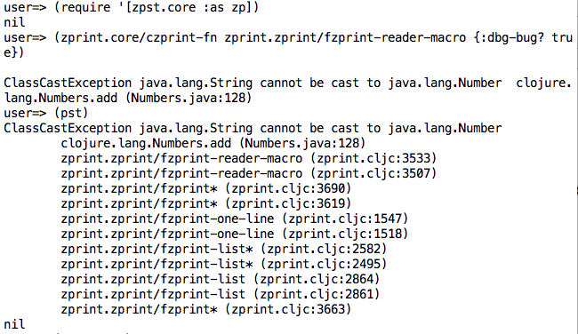
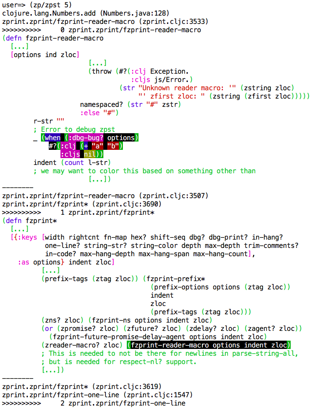
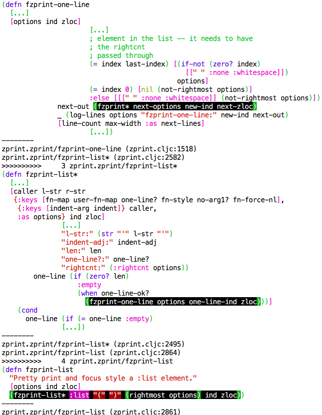
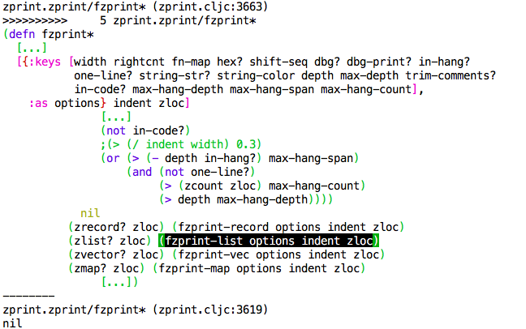
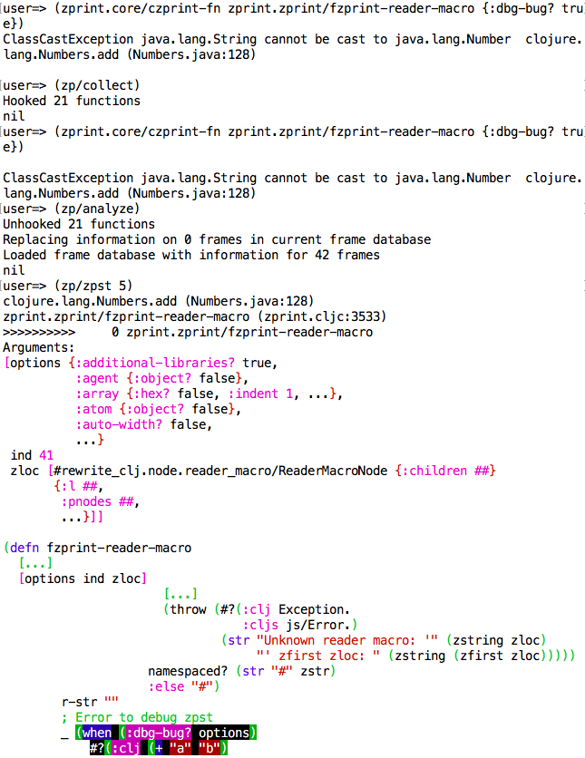
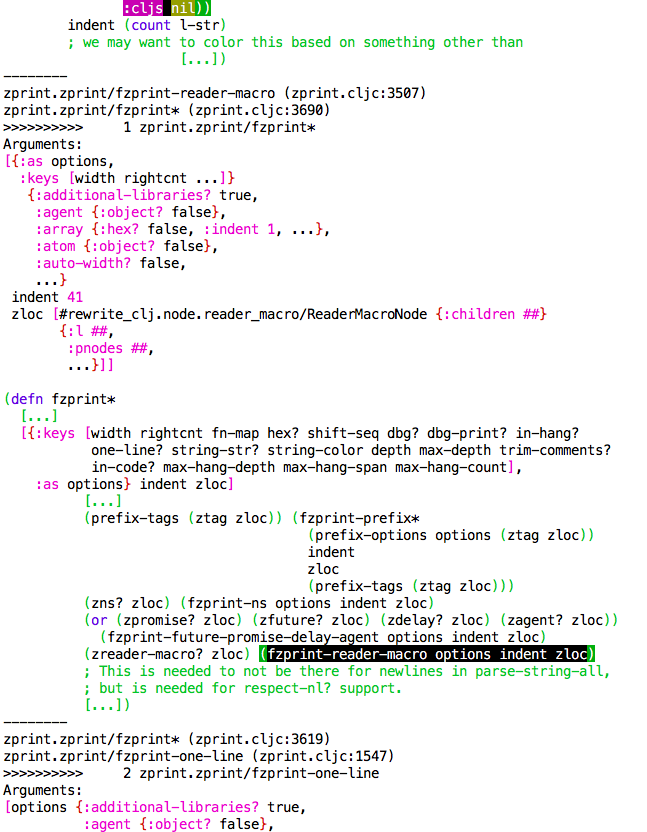
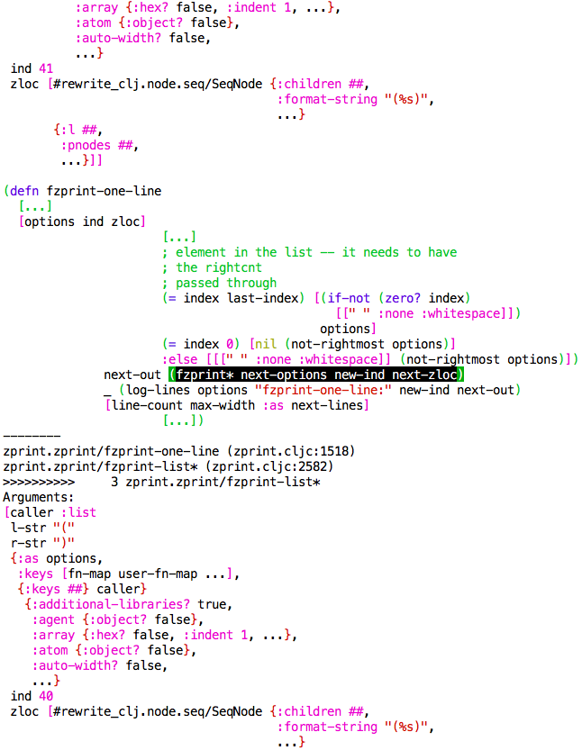
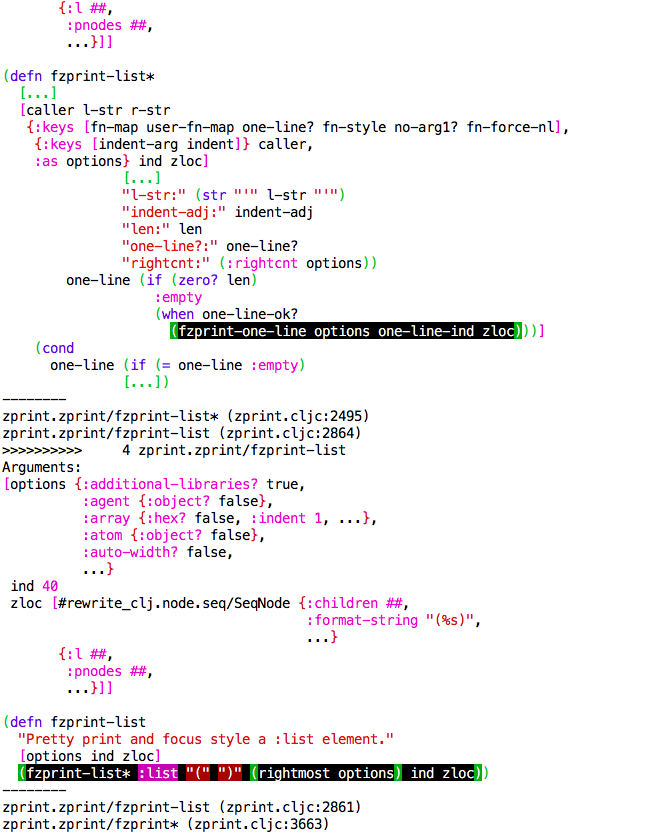
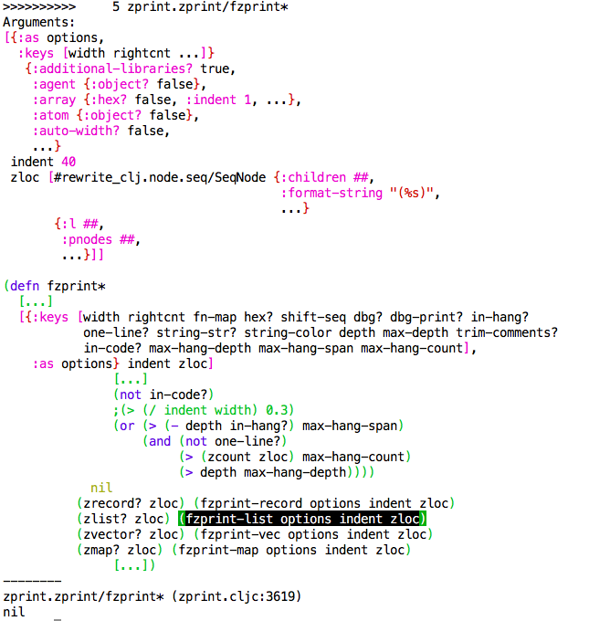

# zpst

__zpst__ is a library to assist debugging of exceptions encountered
at the repl.  It will

  * show source code in stack backtraces
  * allow examination of arguments within stack backtraces
  * let you change the arguments and recreate the conditions that caused the
  exception

zpst will make all of this possible with no changes to your source
code.  You do have to set a JVM switch to keep the exceptions coming,
or the JVM will sort of optimize them out.

## Usage

__Leiningen ([via Clojars](http://clojars.org/zpst))__

[](http://clojars.org/zpst)

## Overview

Before we go any further, you should set this JVM switch:

If you are using Leiningen:
```clojure
  :jvm-opts ["-XX:-OmitStackTraceInFastThrow"]
```
If you aren't using Leiningen, figure out how to set this JVM 
option.

Without this JVM option, sometimes exceptions that are repeated
don't have any data, which means that zpst will work ... sometimes.
Sometimes it won't.  Enough to drive anyone nuts, so you really
want to set this switch. 


There are three increasingly detailed ways to use zpst:

### See the source in a backtrace

You can use zpst just like pst, and it will show you the source inline with the stack backtrace.  
See the [complete information](doc/zpst.md "") on zpst.


First, the exception and the pst:



Next, using zpst to do the same thing:





zpst will highight the expression that does the call.  It also shows the 
name of the function and its argument list.  By default, it skips the 
docstring, but can be configured to include it.  Also by default, it
shows 8 lines before the call, and two after, which is also configurable.

zpst shows the source pretty-printed using zprint, in the same way that
`(czprint-fn <fn-name>)` will pretty print just about any function for
which `(doc <fn-name>)` will show a docstring.  It doesn't just highlight
the line from which the call originated, it highlights the expression
that is the call.

That is the simplest way to use zpst.
See [here](doc/zpst.md "") for detailed 
information.

### See the arguments to the functions in a backtrace

If the exception is deterministic (that is, if you can recreate the exception 
whenever you want), then you can use zpst to "hook" the functions that appear
in the stacktrace to gather the arguments on the way down to the the function
call that caused the exception, and then to make these arguments available 
to you to see.

The workflow here is:

  * You get an exception
  * Use `zpst` to see the source integrated in the stacktrace -- 
  decide you want to see the arguments too
  * Enter: `(zpst.core/collect)`
  * Recreate the exception
  * Enter: `(zpst.core/analyze)` 
  * Use zpst again, and it will show you the arguments to the functions.

See detailed information on [collect](doc/collectanalyze.md ""),
[analyze](doc/collectanalyze.md ""), and the various
[commands](doc/commands.md "").

Here is an exmple, leaving out the first use of `zpst`, since you've already
seen that:







The arguments are printed with zprint, using a feature of zprint which
gives a good overview of a complex datastructure, without drowning you 
in detail.  The options map that zpst uses to print the arguments is
configurable.  

This may be enough for you to figure out what is going on.  If not,
with no additional preparation, there is more you can do.

### Access the arguments in the backtrace, and re-try the call

The data gathered by the `(collect)` and `(analyze)` calls can
be accessed directly, changed, and you can re-evaluate from anywhere
in the stack.

Here is an example of what you can do:

```clojure
;
; We can pick a frame from the previous zpst output, and make that the
; frame that we are focusing on:
;
(set-frame! 3)
Setting current frame to: 3 zprint.zprint/fzprint-list*
;
; From that point, we can recreate the call down into the function
; that had the exception:
;
(re-eval)

ClassCastException java.lang.String cannot be cast to java.lang.Number  clojure.lang.Numbers.add (Numbers.java:128)
;
; We still get the exception, which we would expect
;
; Let's see if we can change one of the arguments to get rid of the
; exception.  Of course, in this case, it isn't difficult since the
; exception is explicitly triggered by one of the arguments, but in
; general, you might want to manipulate the arguments at some point
; in the stack to allow you to see what it would take to get functions
; to operate differently.
;
; You could also change the code of some underlying function in order
; for it to do something differently.  You have lots of options.  In
; this case, though, we will change one of the arguments since that
; is what is 'causing' this exception.
;
(def opt (get-arg 3))
;
; Argument 3 happens to be a zprint options map (since we are using
; zprint as an example of a complex library here).
#'zpst.core/opt
;
; We can create a new options map without the explicit call for the
; bug.  It won't always be this easy, of course!
;
(def new-opt (assoc opt :dbg-bug? false))
#'zpst.core/new-opt
zpst.core=> (set-arg! 3 new-opt)
;
; Now, we can try to evaluate from this point in the stack again...
;
(re-eval)
nil
;
; And, no exception.
;
; The value of the (re-eval) is returned from (get-re-eval-return).
; In this case, it was nil, so it isn't very interesting.
```

### One more thing: epst - extended pst

In order to really understand exceptions and how they operate in
the Clojure and the JVM, particularly in situations where multiple
threads were involved, I needed a bit more clarity than that provided
by `pst`.  I developed `epst` which will show you all of the
exceptions that are nested together.  Nothing fancy, but a bit of
clarity if you are dealing with exceptions.

See [documentation for epst](doc/epst.md "")

# Detailed Documentation

  * [zpst](doc/zpst.md "")
  * [commands](doc/commands.md "")
  * [collect](doc/collectanalyze.md#Collect "")
  * [analyze](doc/collectanalyze.md#Analyze "")
  * [epst](doc/epst.md# "")
  * [options](doc/options.md "")

